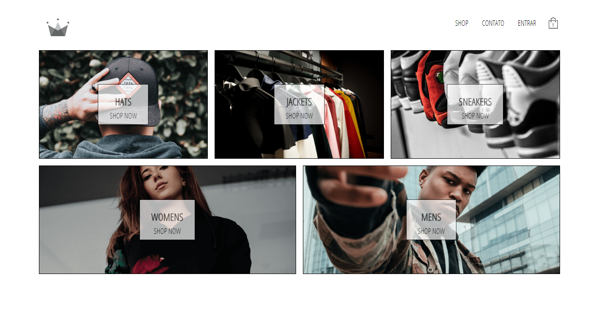
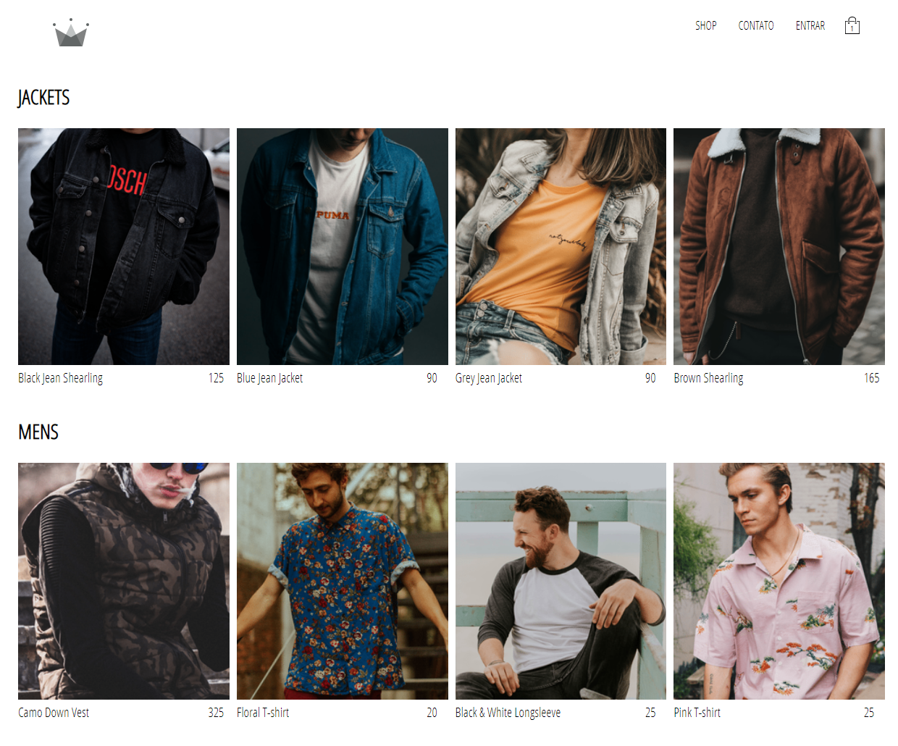
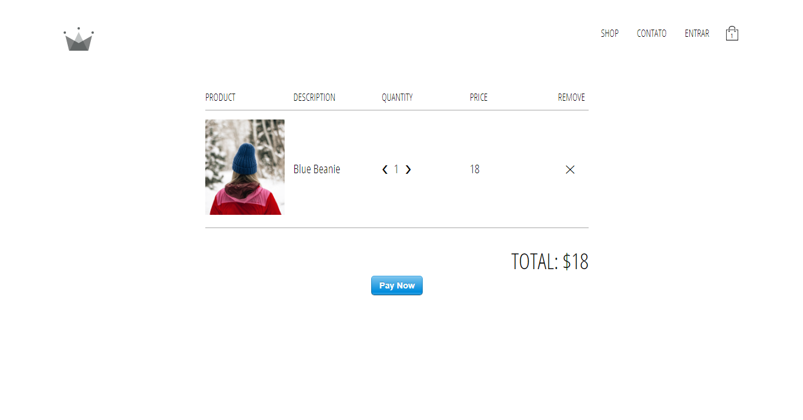

## Crown Clothing 

      
      
    

## Scripts disponiveis

No diretorio desse projeto você pode usar:

### `yarn start & npm start`

Roda o app em modo desenvolvedor. 
Abra a porta [http://localhost:3000](http://localhost:3000) para ver no navegador.

Projeto feito durante o curso: 
https://www.udemy.com/course/complete-react-developer-zero-to-mastery/

